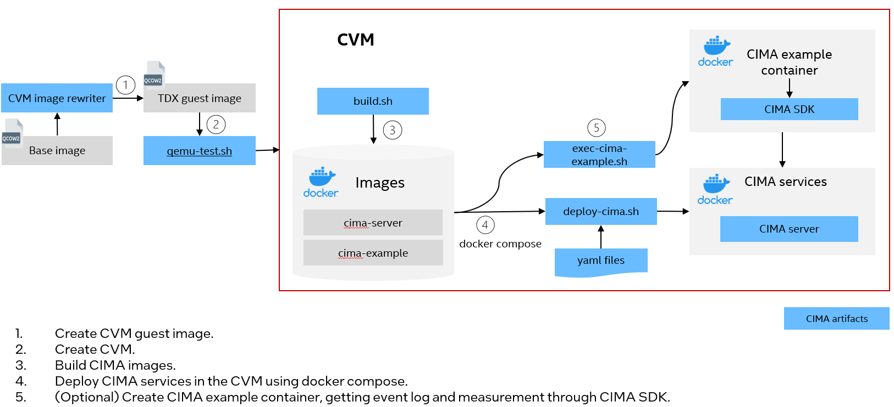

# Docker Compose Deployment

The CIMA can be deployed in the confidential VMs using docker compose. In this document, it will use Intel TDX guest(TD) as an example of CVM and deploy CIMA on the TD using docker compose.




## Deploy CIMA

The following scripts can help to generate CIMA images and deploy them in the TD nodes. `build.sh` can run on either host or TD. Other scripts are supposed to run in the TD.

- [build.sh](../../container/build.sh): The tool will build docker images and push them to remote registry if required. Skip it if you already have docker images prepared.
- [prerequisite.sh](./prerequisite.sh): This tool will complete the prerequisites for deploying CIMA on Ubuntu.
- [deploy-cima.sh](./deploy-cima.sh): The tool will deploy CIMA service using docker compose.
- [exec-cima-example.sh](./exec-cima-example.sh): The tool will create a docker container, getting container event logs, measurement and performing verification using CIMA SDK.

### Prerequisite

Run the script `prerequisite.sh` as below.

```
$ sudo ./prerequisite.sh
```

### Deploy CIMA Service

Use the script [deploy-cima.sh](./depoly-cima.sh) to deploy the CIMA services. 
```
# Deploy CIMA with user specified remote registry and image tag
$ sudo ./deploy-cima.sh -r <remote registry> -g <tag>
e.g.
$ sudo ./deploy-cima.sh -r test-registry.intel.com/test -g 0.5
```

This script has some options as below.
```
Usage: $(basename "$0") [OPTION]...
    -r <registry prefix>    the prefix string for registry
    -g <tag>                container image tag
    -h                      show help info
```

You will see below container running after the deployment.
```
$ sudo docker ps
CONTAINER ID   IMAGE             COMMAND               CREATED        STATUS      PORTS     NAMES
3a9de1a9c7d7  cima-server:0.5  "/usr/bin/cima_serve…" 36 seconds ago  Up 34 seconds  cima-server-ctr-cima-server-1
```

### Deploy CIMA Usage Example 

The script [exec-cima-example.sh](./exec-cima-example.sh) will launch a container `cima-example`.
It will get measurement, event logs and cc_report using CIMA SDK and save the output in `/tmp/docker_cima/example.log`.

```
$ sudo ./exec-cima-example.sh -r test-registry.intel.com/test -g 0.5
```

This script has some options as below.

```
Usage: $(basename "$0") [OPTION]...
    -r <registry prefix>    the prefix string for registry
    -g <tag>                container image tag
    -d			            delete example container
    -h                      show help info
```

You will see below container running after the deployment.
```
$ sudo docker ps
CONTAINER ID   IMAGE               COMMAND            CREATED          STATUS       PORTS     NAMES
e815b6edafcb   cima-example:0.5  "tail -f /dev/null"  17 seconds ago  Up 15 seconds cima-example-ctr-cima-example-1
```

### Clean Up

The script `cleanup.sh` will help stop three containerized services and remove cache.

```
$ sudo ./cleanup.sh
```
